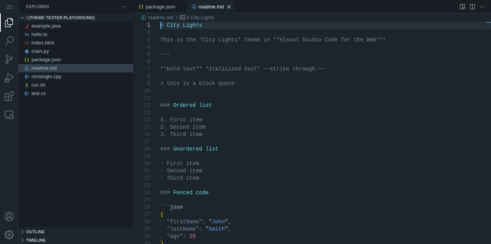
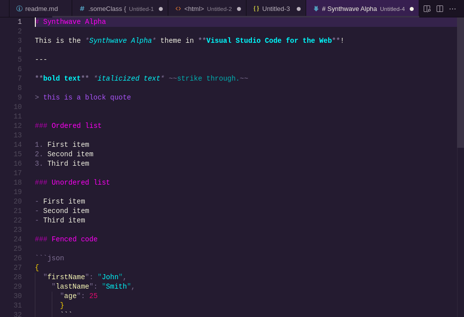
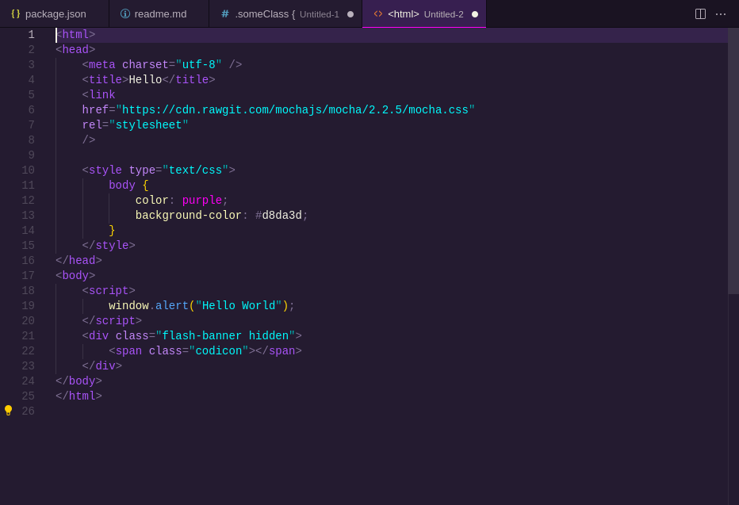
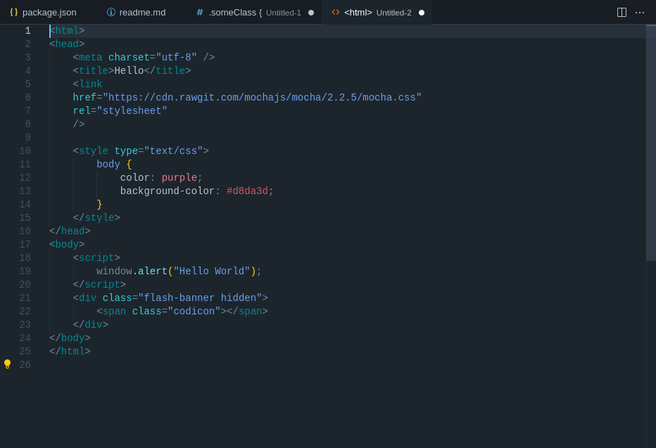
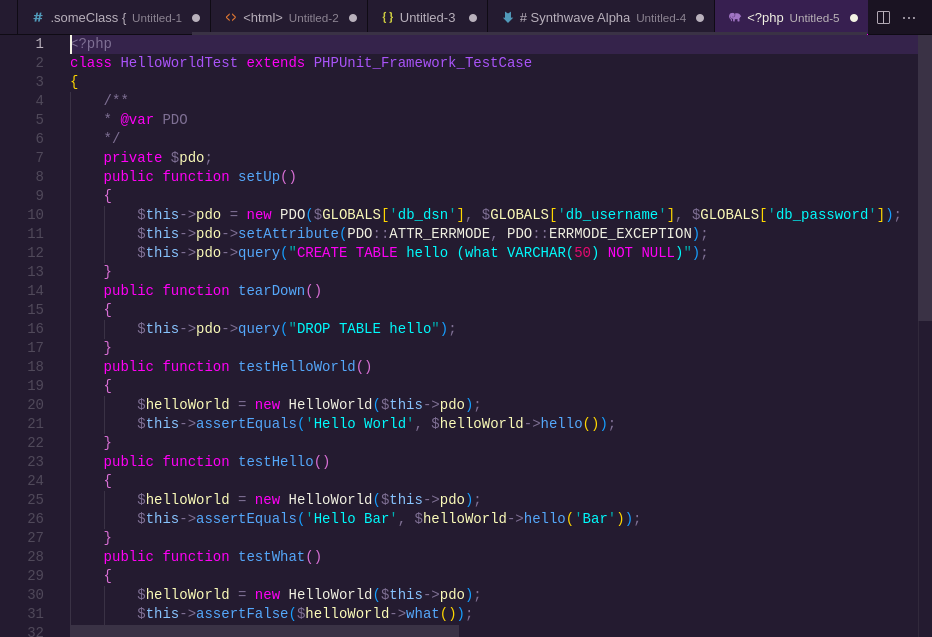
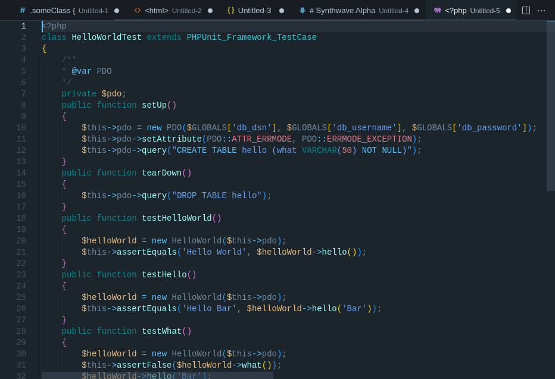

# vscode-theme-screenshots

> Automate screenshots of Visual Studio Code themes

**TLDR**; Use [Playwright](https://playwright.dev/) and [vscode.dev](https://vscode.dev/) to generate screenshots of Visual Studio Code themes.

## Setup

```sh
git clone https://github.com/vikpe/vscode-theme-screenshots
cd vscode-theme-screenshots
npm install
npx playwright install --with-deps chromium
```

## Usage

1. Edit `screenshots.config.ts`
2. Put code samples in `/code_samples`
3. Run `npx playwright test screenshots.spec`
4. Screenshots saved to `/dist/{themeId}/`

## Example

### Config

```ts
import type { ScreenshotConfig } from "./screenshots.types";

const config: ScreenshotConfig = {
  themeIds: ["vikpe.synthwave-alpha", "Yummygum.city-lights-theme"],
  codeSamplesDir: "code_samples",
  outputDir: "dist",

  // remote files opened in the application overview screenshot (app.png)
  // see https://vscode.dev/editor/theme/vikpe.synthwave-alpha for examples
  defaultRemoteFiles: ["package.json", "readme.md"],
};

export default config;
```

### Run

```sh
> npx playwright test screenshots.spec

Running 2 tests using 2 workers

  ✓  1 [chromium] › screenshots.spec.ts:13:6 › Yummygum.city-lights-theme (9.8s)
  ✓  2 [chromium] › screenshots.spec.ts:13:6 › vikpe.synthwave-alpha (9.7s)

  2 passed (10.1s)
```

### Output








