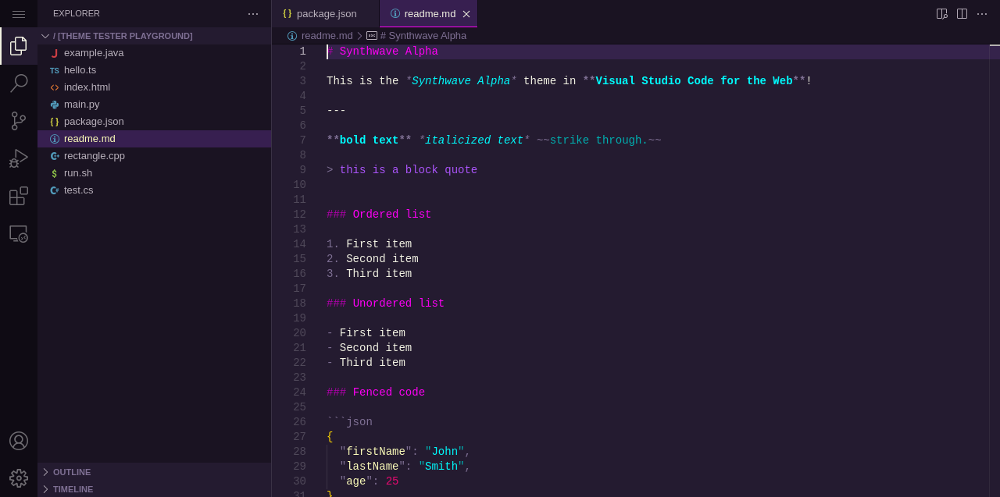

# vscode-theme-screenshots

> Automate screenshots of Visual Studio Code themes

Use [Playwright](https://playwright.dev/) and [vscode.dev](https://vscode.dev/) to generate screenshots of Visual Studio Code themes.

## Setup

```sh
git clone https://github.com/vikpe/vscode-theme-screenshots
cd vscode-theme-screenshots
npm install
npx playwright install --with-deps chromium
```

## Usage

1. Edit `screenshots.config.ts`
2. Run `npx playwright test screenshots.spec`
3. Screenshots saved to `/dist/{themeId}/`.

## Example

### Config

```ts
import type { ScreenshotConfig } from "./screenshots.types";

const config: ScreenshotConfig = {
  themeIds: ["vikpe.synthwave-alpha"],

  // filenames opened by default in overview screenshot
  appOverviewFilenames: ["hello.ts", "readme.md"],

  // files for individual editor screenshots
  // vscode theme playground files
  // see example at: https://vscode.dev/editor/theme/vikpe.synthwave-alpha
  editorFilenames: [
    "example.java",
    "index.html",
    "main.py",
    "readme.md",f
    "run.sh",
  ],
};

export default config;
```

### Output




